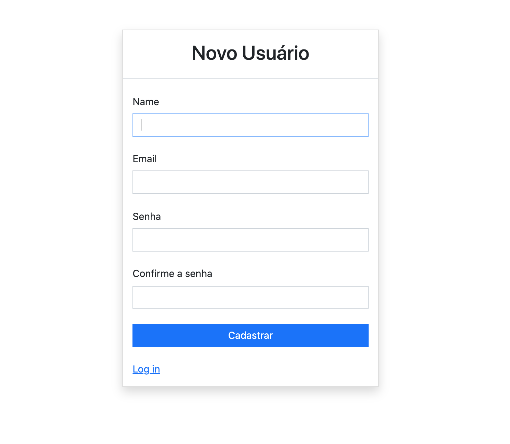
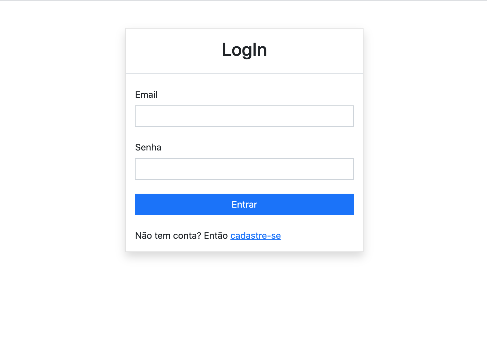
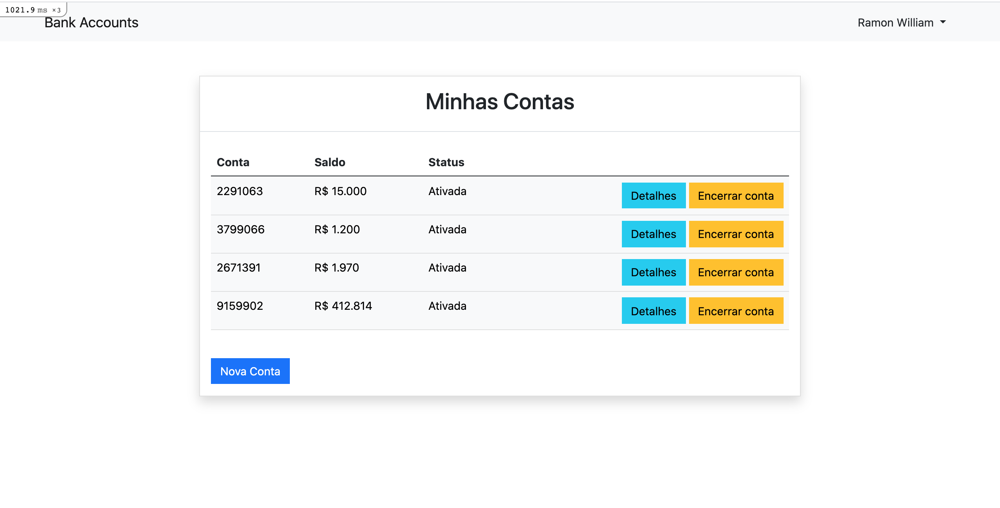
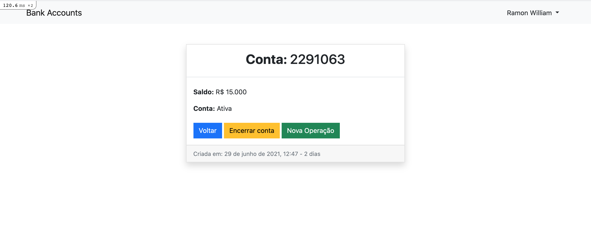
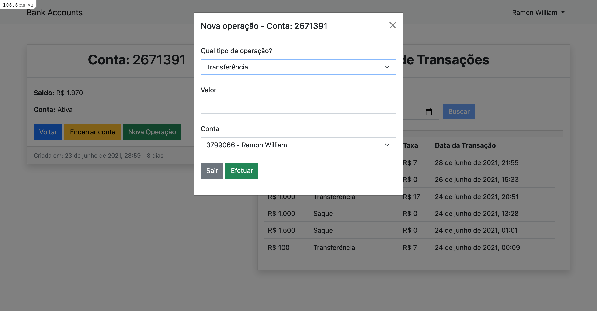
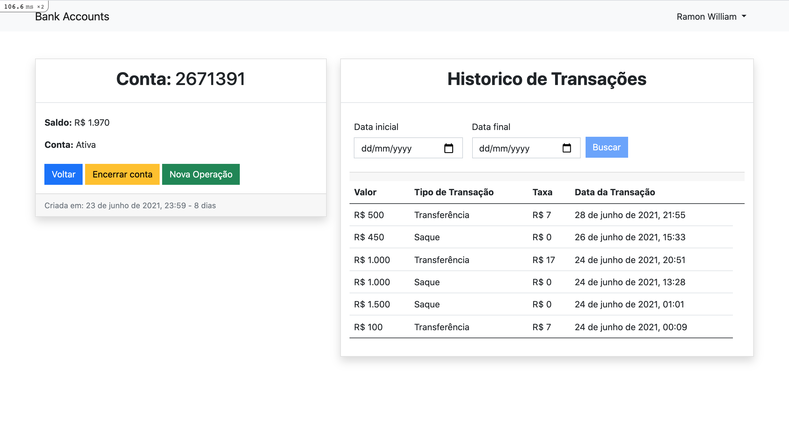

<p align="center">
  

  
  
  <a href="https://github.com/roniewill/lite-bank-app/commits/main">
    
  </a>
    
  
  
  <a href="https://github.com/roniewill/lite-bank-app">
    
  </a>

  <a href="https://www.linkedin.com/in/ramonwilliam/">
    
  </a>
</p>


<h1 align="center"> Lite Bank </h1>

<p align="center">
 <a href="#-about">About</a> •
 <a href="#-features">Features</a> •
 <a href="#-layout">Layout</a> • 
 <a href="#-how-it-works">How it works</a> • 
 <a href="#-tech-stack">Tech Stack</a> • 
 <a href="#contributors">Contributors</a> • 
 <a href="#lisence">Lisence</a>
</p>


## 💻 About

Lite Bank - It is a very simple bank account management system with the purpose of providing a friendly environment for users to carry out the procedures most used in bank accounts as: Transfer, Deposit, Withdraw and Transactions Report.

---


## ⚙️ Features

- [x] User can register using: 
  - Full name 
  - Email 
  - Password 

- [x] User can login using: 
  - Email 
  - Password 
  
- [x] Users have access to the following features: 
  - create one or more accounts with a value from 0 to x 
  - close account if it has a balance equal to 0 
  - can see account details on contains more functions 
  - can transfer amounts to other accounts 
  - can deposit 
  - can withdraw 
  - can see all transactions once they have made one 
  - can filter transactions by start and end date

---


## 🎨 Layout

### Mobile

<p align="center">Coming soon</p>

### Web

<p align="center" style="display: flex; align-items: flex-start; justify-content: center;">
  
  
  
  
  
  
</p>

---


## 🚀 How it works

### Pre-requisites

Before starting, you will need to have the following tools installed and properly configured on your machine:
[Git](https://git-scm.com), [Ruby 2.7.2](https://www.ruby-lang.org/), [Rails 6.1.3](https://rubyonrails.org/), [Node.js](https://nodejs.org/en/), [Yarn](https://yarnpkg.com/) and [PostgreSQL](https://www.postgresql.org/). 
Also it's nice to have an editor to work with code like [VSCode](https://code.visualstudio.com/)

#### RUN

```bash
# Once Ruby and Rails are properly installed, follow the next steps:
# Install bundler
$ gem install bundler

# Clone this repository
$ git clone git@github.com:roniewill/lite-bank-app.git

# Access the project folder cmd/terminal
$ cd lite-bank-app

# open the project with a code editor of your choice
$ code .

# rename the .env.local file to .env and set the access data in the variables

# then run the commands on your terminal
$ bundle install
$ yarn install
$ rails db:create db:migrate
$ rails server 
# or: rails s
# The server will start by default at port: 3000 - go to http://localhost:3000

```

---


## 🛠 Tech Stack

### The following tools were used in the construction of the project:

#### **Main Tools**

-   **[Ruby 2.7.2](https://www.ruby-lang.org/en/downloads/)**
-   **[Rails 6.1.3](https://github.com/rails/rails/tree/v6.1.3)**
-   **[PostgreSQL](https://www.postgresql.org/)**
-   **[Node LTS](https://nodejs.org/en/)**
-   **[Yarn](https://yarnpkg.com/)**
-   **[Bootstrap 5](https://getbootstrap.com/docs/5.0/getting-started/download/)**
-   **[JQuery](https://blog.jquery.com/2021/03/02/jquery-3-6-0-released/)**


#### **Utilities**

-   Tests:  **[RSPec](https://rspec.info/)**
-   Static code analyzer :  **[RuboCop](https://github.com/rubocop/rubocop)**
-   Manager User :  **[Devise](https://github.com/heartcombo/devise)**

#### **Plugins**

- **[Toastr](https://github.com/CodeSeven/toastr)**
- **[Inputmask](https://github.com/RobinHerbots/Inputmask)**
- **[Money-Rails](https://github.com/RubyMoney/money-rails/)**
- **[Dotenv-Rails](https://github.com/bkeepers/dotenv)**

---


## Contributors

<p align="center">Coming soon :)</p>

## How to contribute

1. Fork the project.
2. Create a new branch with your changes: `git checkout -b my-feature`
3. Save your changes and create a commit message telling you what you did: `git commit -m" feature: My new feature "`
4. Submit your changes: `git push origin my-feature`

---


## License

This project is under the license [MIT](./LICENSE).

Made with a lot of love and dedication by Ramon William 👋🏽 [Get in Touch!](Https://www.linkedin.com/in/ramonwilliam/)
